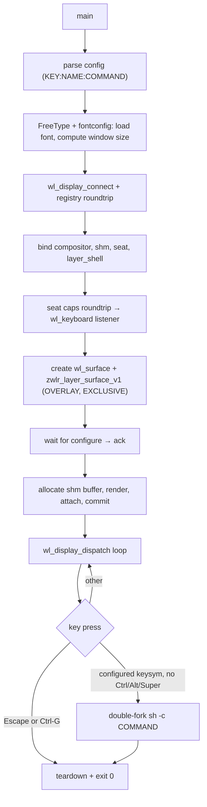

# wlnch implementation notes

Reference for how `wlnch` is put together. Aimed at future-me (and contributors)
who need to extend, debug, or port the launcher. The high-level usage docs live
in [`README.md`](README.md); this file is the *internals*.

## At a glance

- Language: C11.
- Build: plain `make` + `wayland-scanner`. No CMake, no autotools.
- Runtime deps: `libwayland-client`, `libxkbcommon`, `libfreetype`,
  `libfontconfig`, plus `librt` for `memfd_create`.
- One translation unit: [`wlnch.c`](wlnch.c). Sections are explicitly numbered
  in the file's top comment so you can jump around.
- Two vendored protocol XMLs under [`protocols/`](protocols/):
  - `wlr-layer-shell-unstable-v1.xml` — the actual protocol used.
  - `xdg-shell.xml` — only there because the layer-shell scanner output
    references `xdg_popup_interface` (from a `get_popup` request we never
    call). Without it the link step fails with an undefined symbol.

## High-level flow



## Why this shape

A few non-obvious decisions that drove the design.

### Why `wlr-layer-shell` instead of `xdg-shell`

Wayland deliberately has no equivalent of X11's override-redirect. With plain
`xdg-shell` the compositor manages the window: it can decorate it, place it,
deny focus, and there is no protocol-level way to demand keyboard focus. That
makes a launcher impossible to implement correctly on top of `xdg-shell`.

`wlr-layer-shell-unstable-v1` solves both problems in one go:

- The `OVERLAY` layer sits above normal windows and is not part of the regular
  window stack — no titlebar, no compositor-imposed placement decisions.
- `set_keyboard_interactivity(EXCLUSIVE)` *requires* the compositor to route
  all keyboard input to this surface while it's mapped.

The trade-off is that GNOME/Mutter has consistently refused to implement
layer-shell, so `wlnch` does not run on GNOME. wlroots-based compositors
(Sway, Hyprland, river, niri, Wayfire, ...) and KDE/KWin all support it.

### Why a single TU

The project is small enough (~620 lines) that a single `.c` file is easier to
read than four files plus headers. The numbered sections in the top comment
substitute for module headers. If it grows past ~1000 lines, splitting the
config parser and the renderer out is the obvious next step.

### Why software rendering

A launcher draws once and stays static. There is no animation, no scrolling,
no incremental redraw. Pulling in EGL + GLES (or Vulkan) just to fill an ARGB
buffer with text would be silly. Plain `wl_shm` is faster to start, easier to
debug, and avoids GPU dependencies entirely.

### Why FreeType + fontconfig and not pangocairo

The user asked for "no GUI frameworks". Cairo + Pango is the canonical
text-rendering stack on Linux but it brings substantial dependencies and
behaves like a small framework. FreeType for glyph rendering and fontconfig
for font selection are the lowest-level useful pair: FreeType produces 8-bit
grayscale coverage bitmaps that we alpha-blend into the buffer ourselves.
This keeps the whole "draw" path under 100 lines and free of any layout
engine.

The cost is that we don't do shaping (no ligatures, no complex scripts, no
RTL). For a launcher that displays single-character keys and short ASCII-ish
labels, that's fine.

### Why double-fork to spawn

We `fork`, `setsid`, `fork` again, and only the grandchild `exec`s. The
immediate child exits right after the second fork. This means:

1. The grandchild's parent is `init` (PID 1) — when `wlnch` exits a
   millisecond later, nothing notices the orphan.
2. The grandchild is in its own session, so it doesn't share a controlling
   terminal with `wlnch`. If `wlnch` was launched from a terminal, closing
   that terminal won't `SIGHUP` the spawned app.
3. We `waitpid` on the immediate child so it doesn't become a zombie. The
   grandchild needs no reaping by us at all.

`stdin` is redirected to `/dev/null` for the grandchild so commands that
naively read stdin don't block on a closed pipe.

## Config format

```
KEY[&]:NAME:COMMAND
```

- Lines beginning with `#` and blank lines are ignored. A leading `#!`
  shebang is therefore naturally skipped.
- `KEY` is a single UTF-8 character (1–4 bytes).
- An optional `&` between the key and the first `:` marks the entry as
  *sticky* (see below).
- The first two `:` (after the optional `&`) are the field separators.
  `COMMAND` may contain any number of `:`.
- Match is case-sensitive: `s` and `S` are different bindings (the latter
  requires Shift). This is achieved by converting the codepoint to an xkb
  keysym with `xkb_utf32_to_keysym`, which gives `XKB_KEY_s` vs `XKB_KEY_S`.

### Sticky entries

A binding written as `KEY&:NAME:COMMAND` keeps `wlnch` running after
spawning the command, so the user can press it again (or another key)
without re-launching the chooser. Use case: a one-off launcher for a
desktop environment where you want to spawn several terminals or browser
windows in succession without dismissing the menu between them.

Implementation:

- The parser recognises an optional `&` between the decoded key codepoint
  and the first `:`, and stores it as `bool sticky` on `struct entry`.
- The dispatch path always calls `spawn_command` on a match; it only
  sets `g_running = 0` when `!entry.sticky`.
- `Esc` and `Ctrl-G` continue to exit unconditionally — sticky bindings
  are about *spawn* events, not about how to leave the launcher.
- The visual cue for stickiness is **color**, not extra glyphs: the key
  letter inside `[...]` is drawn in `COLOR_KEY_STICKY` (reddish) instead
  of the regular `COLOR_KEY` (blue accent). Bracket geometry is identical
  for sticky and non-sticky rows, so all names align without padding
  tricks.

### Where the config comes from

There is no XDG-style default search path. The CLI is deliberately
minimal:

```
wlnch [-f FONT] [CONFIG]
```

- If a positional `CONFIG` argument is given, it's opened with `fopen`.
- Otherwise the parser reads from stdin.

This shape exists to make `#!/usr/local/bin/wlnch` shebangs work cleanly:
when the user `chmod +x`s their `wlnchrc`, the kernel runs
`/usr/local/bin/wlnch /path/to/wlnchrc`, which is exactly the positional
argument case. No env-var lookups, no implicit "find a config", no
surprises.

Reading from stdin keeps the door open for `wlnch < some-config`,
`generate-config | wlnch`, or test harnesses without temp files.

The parser operates on a `FILE *` so the same code path handles both
sources. Error messages quote the source as either the file path or
`<stdin>`.

Storage: a growable array of `struct entry { uint32_t codepoint; xkb_keysym_t
keysym; char *name; char *command; }`.

## Wayland setup in detail

### Globals we bind

| Interface              | Min version | Bound version cap |
| ---------------------- | ----------- | ----------------- |
| `wl_compositor`        | 1           | 4                 |
| `wl_shm`               | 1           | 1                 |
| `wl_seat`              | 1           | 5                 |
| `zwlr_layer_shell_v1`  | 1           | 4                 |

If `zwlr_layer_shell_v1` is missing we abort with a message that explicitly
mentions GNOME, because that is the overwhelmingly common cause.

### Two roundtrips during init

- First `wl_display_roundtrip` — drains the registry's `global` events so we
  know what's available.
- Second `wl_display_roundtrip` — drains seat `capabilities` events so a
  `wl_keyboard` exists before we map the surface. Without this, the first
  keyboard `keymap`/`enter` events can race with the layer-surface configure
  and you end up with a window that ignores keys for one frame.

### Layer surface configuration

```c
zwlr_layer_shell_v1_get_layer_surface(g_layer_shell, g_surface, NULL,
    ZWLR_LAYER_SHELL_V1_LAYER_OVERLAY, "wlnch");
zwlr_layer_surface_v1_set_size(s, win_w, win_h);
zwlr_layer_surface_v1_set_keyboard_interactivity(s,
    ZWLR_LAYER_SURFACE_V1_KEYBOARD_INTERACTIVITY_EXCLUSIVE);
```

- No anchors are set, so the compositor centers the surface.
- `set_size(w, h)` is computed from text metrics (see
  [Window sizing](#window-sizing)).
- `wl_surface_commit` is called *without* an attached buffer to enter the
  configure handshake. The buffer is attached only after the compositor
  sends its first `configure` event.

### Configure handshake

The protocol contract: after each `configure` event we must call
`zwlr_layer_surface_v1_ack_configure(serial)`, and we may not present a
buffer until we've acked at least once.

We track this with a `g_buffer_attached` flag so reconfigure events (e.g.
output scale changes) don't re-allocate buffers we don't need to redraw.

## SHM buffer

```c
int fd  = memfd_create("wlnch-shm", MFD_CLOEXEC | MFD_ALLOW_SEALING);
ftruncate(fd, size);
void *mem = mmap(NULL, size, PROT_READ|PROT_WRITE, MAP_SHARED, fd, 0);
struct wl_shm_pool *pool = wl_shm_create_pool(g_shm, fd, size);
struct wl_buffer   *buf  = wl_shm_pool_create_buffer(pool, 0,
                              w, h, w*4, WL_SHM_FORMAT_ARGB8888);
wl_shm_pool_destroy(pool);
close(fd);
```

- `WL_SHM_FORMAT_ARGB8888` is little-endian byte order. On a little-endian
  host, a `uint32_t` literal `0xAARRGGBB` lays out as `B,G,R,A` in memory,
  which is what the compositor expects. We assume LE; this isn't portable
  to BE hosts but Linux desktops are essentially all LE.
- We never call `wl_buffer.release` listeners. Because the launcher is
  one-shot, releasing the buffer at exit happens implicitly when the
  Wayland connection is torn down. If the program ever needs to redraw
  more than once, this should be wired up properly.
- We use `memfd_create` directly rather than `wl_shm_open`-style helpers.
  `MFD_CLOEXEC` prevents leaking the fd into spawned commands;
  `MFD_ALLOW_SEALING` is set in case a future change wants to seal the fd
  against further size changes.

## Text rendering

### Font selection

```c
FcPattern *pat   = FcNameParse(pattern);
FcConfigSubstitute(NULL, pat, FcMatchPattern);
FcDefaultSubstitute(pat);
FcPattern *match = FcFontMatch(NULL, pat, &result);
/* read FC_FILE, FC_INDEX, FC_PIXEL_SIZE from match */
FT_New_Face(g_ft_lib, file, index, &g_ft_face);
FT_Set_Pixel_Sizes(g_ft_face, 0, size);
```

- The pattern comes from `-f`, then `$WLNCH_FONT`, then `monospace` as
  default.
- Pixel size comes from the matched pattern (so `monospace:size=20` works)
  and falls back to `DEFAULT_FONT_PIXEL` (18).

We cache `face->size->metrics.height >> 6` (line height) and `ascender >> 6`
(baseline offset from the row top) once. All metrics are in 26.6 fixed
point in FreeType, hence the `>> 6`.

### Glyph blending

`FT_Load_Char(face, cp, FT_LOAD_RENDER)` produces an 8-bit grayscale
coverage bitmap in `face->glyph->bitmap`. For each pixel:

```
alpha   = coverage * fg_alpha / 255
out_rgb = (fg_rgb * alpha + dst_rgb * (255 - alpha)) / 255
out_a   = alpha + dst_a * (255 - alpha) / 255
```

This is "over" compositing with straight (non-premultiplied) alpha. Wayland
itself is fine with either, but our bg fill is opaque-ish (`0xF0` alpha) and
foreground is `0xFF`, so the maths is straightforward.

Glyph position uses FreeType's metrics:

- `bitmap_left` — x offset from pen position to the left edge of the
  bitmap.
- `bitmap_top` — y offset from baseline to the top edge (note: positive Y
  means up in FreeType, but our pixel buffer's Y grows downward, so we
  subtract).
- `advance.x >> 6` — horizontal pen advance after the glyph.

### Window sizing

Two passes through the entries:

1. Compute the widest "[k]" cell across all entries (the bracketed key).
2. Compute the widest entry name.

Window dimensions:

```
W = 2*PADDING_X + key_cell_w + KEY_GAP + max_name_w
H = 2*PADDING_Y + n_entries * (line_height + ROW_GAP) - ROW_GAP
```

Both rounded up to multiples of two to avoid odd-stride surprises.

### Row drawing

For each entry, at baseline `y`:

```
"[" in COLOR_SEP
key in COLOR_KEY      ← accent
"]" in COLOR_SEP
pad x to (PADDING_X + key_cell_w + KEY_GAP)
name in COLOR_FG
```

Pixel colors are compile-time constants near the top of the file. Theming
via the config file is intentionally out of scope; the natural extension is
to add `bg=`, `fg=`, `accent=` directives to the parser.

## Keyboard handling

### Keymap / state lifecycle

```
wl_keyboard.keymap   → mmap fd → xkb_keymap_new_from_string → xkb_state_new
wl_keyboard.modifiers → xkb_state_update_mask
wl_keyboard.key       → resolve keysym via xkb_keymap_key_get_syms_by_level
                        with layout = 0 (see below)
```

The `+ 8` between Wayland keycodes and xkbcommon keycodes is the standard
evdev → X11 offset. xkbcommon expects X11-style keycodes.

We rebuild keymap and state on every `keymap` event (the compositor may
send a fresh one when layout changes), unref'ing the previous pair.

### Layout independence

`xkb_state_key_get_one_sym` would honor the user's currently active
layout group — meaning a `e:emacs:…` binding silently fails when the
user has switched to a Cyrillic / Greek / Dvorak / etc. layout, because
the physical "E" key no longer produces `XKB_KEY_e`.

Instead we resolve the keysym against **layout 0**, the first layout the
user configured (essentially always a Latin layout). The lookup looks
like:

```c
xkb_layout_index_t layout = 0;
xkb_level_index_t  level  = xkb_state_key_get_level(state, keycode, layout);
const xkb_keysym_t *syms;
int n = xkb_keymap_key_get_syms_by_level(keymap, keycode, layout, level, &syms);
```

Note that `xkb_state_key_get_level` *does* take the current modifier
state into account, so Shift still flips the level (level 0 → level 1)
and we get `XKB_KEY_S` instead of `XKB_KEY_s` for shift+s. CapsLock,
Num Lock and other latched / locked modifiers also work as expected.

Only the layout *group* is forced to 0; everything else flows through
xkbcommon normally.

This is the same trick `sxhkd`, `swaybind`, and other launcher /
hotkey daemons use; it matches what users intuitively expect ("Latin
letter binds keep working when I switch input language").

### Match logic

Order on every key *press*:

1. `XKB_KEY_Escape` → exit.
2. Ctrl active and sym is `XKB_KEY_g` or `XKB_KEY_G` → exit. (Both because
   Ctrl-Shift-G should also be honored if the user holds shift.)
3. Ctrl, Alt, or Super active → ignore. We don't want `Ctrl+e` to launch
   emacs, that would be confusing.
4. Otherwise scan `g_entries` for a matching keysym; if found, spawn that
   command and exit.

Modifier checks use `xkb_state_mod_name_is_active(... XKB_STATE_MODS_EFFECTIVE)`
which handles latched and locked modifiers correctly.

## Build system

### Make rules

Pattern rules drive `wayland-scanner` once per protocol XML:

```makefile
$(PROTO_DIR)/%-client-protocol.h: $(PROTO_DIR)/%.xml
	wayland-scanner client-header $< $@

$(PROTO_DIR)/%-protocol.c: $(PROTO_DIR)/%.xml
	wayland-scanner private-code  $< $@
```

`wlnch.o` depends on all generated headers, the generated `*-protocol.o`
objects link in alongside `wlnch.o`. `make clean` removes the generated
sources and headers as well as the binary.

### `pkg-config` packages

```
wayland-client  — libwayland + wl_* interfaces
xkbcommon       — keyboard handling
freetype2       — glyph rasterization
fontconfig      — font lookup
```

Plus `-lrt` for `memfd_create` on older glibc; recent glibc has it in
libc itself but `-lrt` is harmless either way.

## Testing notes

Without an interactive test harness, the cheapest sanity checks are:

```sh
make                                   # clean build, no warnings
./wlnch -h                             # usage banner, exit 0
./wlnch /no/such/file                  # error path: cannot open
./wlnch <bad-config>                   # error path: parser line/colno
timeout 1 ./wlnch wlnchrc.example      # exit 124 from timeout = no errors
echo 'q:quit:true' | timeout 1 ./wlnch # stdin path
```

Any stderr output during the timeout run is a real bug — the launcher
should be silent on the happy path.

For interactive testing, run inside a wlroots compositor or KDE Plasma
session, point `WAYLAND_DEBUG=1` at it to see the protocol traffic, and
verify:

- The window is centered, opaque-ish dark, and lists the bindings.
- Pressing a configured letter runs the command and exits.
- Pressing `Esc` exits without running anything.
- Pressing `Ctrl-G` exits without running anything.
- Pressing an unbound letter is ignored.
- Resizing the output / changing scale doesn't crash the launcher (the
  `closed` event is wired up too).

## Likely future work

Roughly in order of usefulness:

1. **Theming via config**: parse `bg`, `fg`, `accent`, `font`, `padding`
   directives at the top of the config and feed them to the renderer.
2. **HiDPI**: read the `wl_output.scale` (or `preferred_buffer_scale` on
   newer compositors) and multiply pixel sizes accordingly. Right now the
   buffer is rendered at logical pixels and the compositor scales it,
   which looks blurry on HiDPI screens.
3. **Live filtering**: type to narrow the list. This implies a real text
   buffer, redraws, and probably a frame-callback-driven render loop.
4. **Mouse support**: clicking an entry to launch it. Layer-shell delivers
   pointer events the same way as any other surface.
5. **Multiple sections / submenus**: nested `wlnchrc` files keyed off a
   prefix character, e.g. press `m` to enter a media submenu.
6. **Frame callback + buffer release tracking**: needed for any of (2), (3),
   (4) to be done correctly — we currently leak the single buffer at exit.
